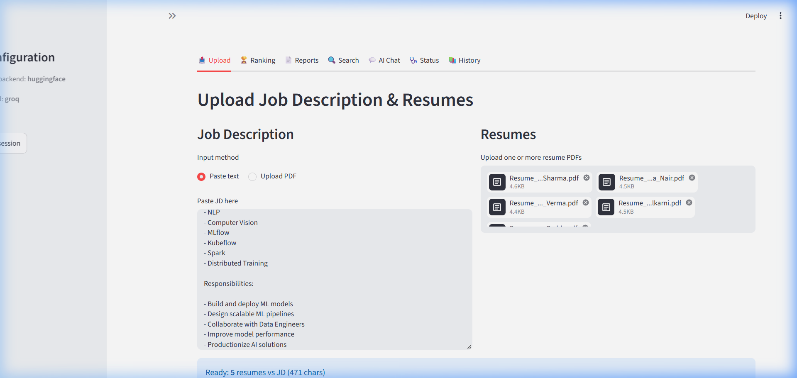
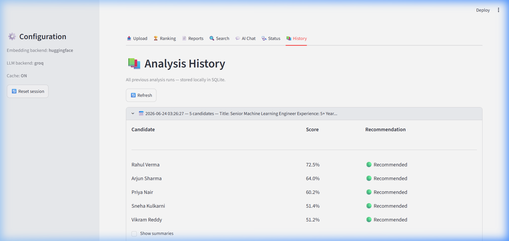
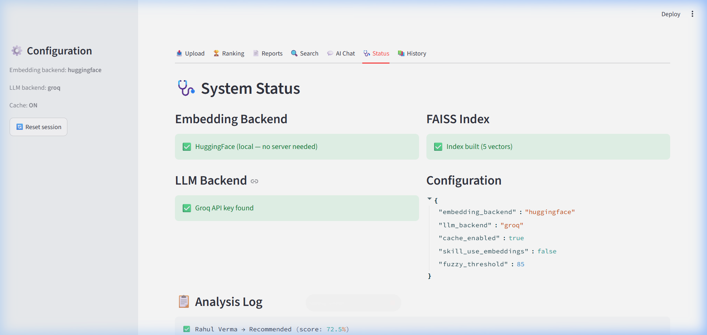
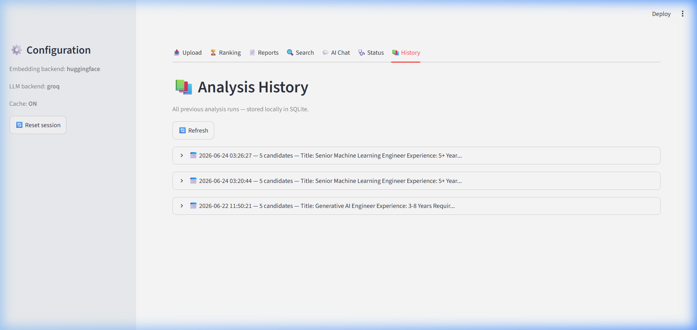

# 🤖 AI Recruiter Assistant — Semantic Resume Screener

[](https://www.python.org/)
[](https://streamlit.io)
[](https://github.com/psf/black)
[](https://github.com/astral-sh/ruff)
[](LICENSE)

An enterprise-grade, end-to-end AI resume screening and ranking solution. Built on a hybrid architecture combining PyMuPDF parsing, FAISS vector databases, semantic NLP keyword matching, and a modular LangGraph multi-agent orchestration layer. It enables recruiters to upload a job description alongside batches of candidate PDF resumes, performing deep qualitative analysis, structured telemetry logging, and local SQLite persistence.

---

## 📌 Table of Contents

1. [✨ Key Features](#-key-features)
2. [🏗️ System Architecture](#️-system-architecture)
3. [🚀 Getting Started](#-getting-started)
   - [Prerequisites](#prerequisites)
   - [1. Clone the Repository](#1-clone-the-repository)
   - [2. Virtual Environment Setup](#2-virtual-environment-setup)
   - [3. Dependency Installation](#3-dependency-installation)
   - [4. Environment Configuration](#4-environment-configuration)
   - [5. Run the Application](#5-run-the-application)
4. [⚙️ Configuration Options](#️-configuration-options)
   - [Embedding Backends](#embedding-backends)
   - [LLM Orchestration](#llm-orchestration)
   - [Settings Schema](#settings-schema)
5. [🖥️ Walkthrough & Screenshots](#️-walkthrough--screenshots)
   - [Upload Portal](#upload-portal)
   - [Candidate Rankings & Profiles](#candidate-rankings--profiles)
   - [Reports & Analytics Exports](#reports--analytics-exports)
   - [Natural Language Semantic Search](#natural-language-semantic-search)
   - [Groq-powered Recruiter AI Chat](#groq-powered-recruiter-ai-chat)
   - [Telemetry & System Status](#telemetry--system-status)
   - [SQLite History Audit log](#sqlite-history-audit-log)
6. [🧪 Testing & Quality Assurance](#-testing--quality-assurance)
   - [Unit & Integration Testing](#unit--integration-testing)
   - [Code Coverage Report](#code-coverage-report)
   - [Code Quality & Linting](#code-quality--linting)
7. [🤝 Contributing Guidelines](#-contributing-guidelines)
   - [Git Workflow](#git-workflow)
   - [Coding Standards](#coding-standards)
8. [📜 License](#-license)
9. [🙏 Acknowledgments](#-acknowledgments)

---

## ✨ Key Features

- 📄 **High-Fidelity PDF Parsing** – Custom text cleaning and reconstruction pipeline utilizing PyMuPDF (`fitz`), handling ligatures, blank lines, and broken hyphens.
- 🔍 **Cosine Similarity Semantic Ranking** – Compares resume texts to the job description via embeddings to produce an initial match percentage.
- 🧩 **NLP Skill Gap Analysis** – Performs structured extraction of matched, missing, and bonus candidate skills using `rapidfuzz` string similarity.
- 🤖 **Multi-Agent Recruiter Pipeline** – Orchestrates a sequential LangGraph agent pipeline to generate experience summaries, qualitative skill assessments, and raw recommendation levels (*Recommended*, *Needs Review*, or *Not Recommended*).
- 🗂️ **Persistent FAISS Vector Store** – Builds a localized index of candidates for fast, on-the-fly semantic querying.
- ⚙️ **Dual Embedding Support** – Offers local vector computation via Ollama (`nomic-embed-text`) or serverless cloud computation using HuggingFace sentence-transformers.
- ⏱️ **Robust SQLite Persistence & Telemetry** – Captures execution latency, token costs, and detailed recruiter queries in SQLite database.
- 📊 **Dynamic Visualization & PDF/CSV Export** – Renders responsive match score charts with Plotly, alongside instant download triggers for structured CSV datasets or professional PDF recruiter briefings.

---

## 🏗️ System Architecture

```
                       ┌─────────────────────────┐
                       │   Streamlit Web Front   │
                       └────────────┬────────────┘
                                    │
                                    ▼
                       ┌─────────────────────────┐
                       │   app.py Orchestrator   │
                       └────────────┬────────────┘
                                    │
       ┌────────────────────────────┼────────────────────────────┐
       ▼                            ▼                            ▼
┌──────────────┐             ┌──────────────┐             ┌──────────────┐
│ utils/parser │             │  vectorstore │             │ utils/skills │
│ (PyMuPDF)    │             │   (FAISS)    │             │ (RapidFuzz)  │
└──────────────┘             └──────┬───────┘             └──────────────┘
                                    │
                                    ▼
                             ┌──────────────┐
                             │utils/ranking │
                             │(Cosine Sim.) │
                             └──────┬───────┘
                                    │
                                    ▼
                             ┌──────────────┐
                             │agents/agent  │
                             │ (LangGraph)  │
                             └──────────────┘
```

The data flow works sequentially:
1. **Extraction**: Uploaded resumes are cleaned and normalized.
2. **Indexing & Similiarity**: Texts are vectorized, loaded into a FAISS memory-cache, and ranked relative to the Job Description text.
3. **Keyword Gap Matching**: Explicit matching rules filter and match JD keywords with Candidate skill strings.
4. **Agent Assessment**: The structured state payload is processed through LangGraph sub-agents, which generate summary summaries, recommendations, and finalize the structured analysis database entry.

---

## 🚀 Getting Started

### Prerequisites

Ensure you have the following installed on your machine:
- **Python 3.10+**
- **pip** package manager
- (Optional) **Ollama** running locally for offline embedding models.

### 1. Clone the Repository

```bash
git clone https://github.com/your-username/resume-screener.git
cd resume-screener
```

### 2. Virtual Environment Setup

Initialize and activate a virtual environment:

```bash
# Windows
python -m venv venv
venv\Scripts\activate

# macOS / Linux
python3 -m venv venv
source venv/bin/activate
```

### 3. Dependency Installation

Install all required core packages:

```bash
pip install -r requirements.txt
```

If setting up a development workspace, also install development utilities ( Ruff, pytest, Black, mypy):

```bash
pip install -r requirements-dev.txt
```

### 4. Environment Configuration

Create a `.env` file in the root directory by copying settings:

```bash
# Copy settings template
cp .env.example .env
```

Ensure you configure your credentials and endpoint overrides inside `.env`:

```env
EMBEDDING_BACKEND=huggingface
LLM_BACKEND=groq
GROQ_API_KEY=your_groq_api_key_here
OPENAI_API_KEY=your_openai_api_key_here
LOG_LEVEL=INFO
```

### 5. Run the Application

Start the Streamlit application server:

```bash
streamlit run app.py
```

The application will launch and should automatically open in your default browser at `http://localhost:8501`.

---

## ⚙️ Configuration Options

### Embedding Backends
- **HuggingFace**: Completely serverless, running local models (`all-MiniLM-L6-v2`) via `sentence-transformers`.
- **Ollama**: Connects to a local Ollama instance (default port `11434`) using custom pull layers like `nomic-embed-text`.

### LLM Orchestration
The recruitment summaries use one of three LLM orchestration backends:
1. **Groq**: Extremely fast inference using `llama-3.3-70b-versatile` (Default).
2. **OpenAI**: Powerful developer API accessing `gpt-4o-mini` or higher.
3. **Ollama**: Completely offline local inference via model images (e.g. `llama3`).

### Settings Schema

A structured table of available `.env` parameters is detailed below:

| Environment Variable | Description | Allowed Values | Default |
|:---|:---|:---|:---|
| `EMBEDDING_BACKEND` | Active embedding engine to vectorize texts. | `ollama`, `huggingface` | `huggingface` |
| `OLLAMA_EMBED_MODEL` | Ollama model utilized to calculate document vectors. | Ollama models | `nomic-embed-text` |
| `OLLAMA_BASE_URL` | Ollama local API base endpoint. | String (URL) | `http://localhost:11434` |
| `HF_EMBED_MODEL` | HuggingFace model cache identifier string. | HuggingFace models | `sentence-transformers/all-MiniLM-L6-v2` |
| `LLM_BACKEND` | Language model backend used for LangGraph. | `groq`, `ollama`, `openai` | `groq` |
| `GROQ_MODEL` | Specific model card requested from Groq API. | Groq model cards | `llama-3.3-70b-versatile` |
| `OPENAI_MODEL` | Specific model card requested from OpenAI API. | OpenAI model cards | `gpt-4o-mini` |
| `GROQ_API_KEY` | Developer authorization token for Groq console. | String (API Key) | `""` |
| `OPENAI_API_KEY` | Developer authorization token for OpenAI console. | String (API Key) | `""` |
| `LOG_LEVEL` | Logging filter cutoff severity. | `DEBUG`, `INFO`, `WARNING`, `ERROR` | `INFO` |
| `CACHE_ENABLED` | Toggle disk-cached embedding models on / off. | `true`, `false` | `true` |

---

## 🖥️ Walkthrough & Screenshots

### Upload Portal
Upload a custom Job Description alongside an arbitrarily large batch of PDF resumes. Built-in validation structures confirm character counts and parsing safety before unlocking the run trigger.



### Candidate Rankings & Profiles
Renders match scores visually using interactive Plotly horizontal bar charts (color-coded by hiring recommendation). Clicking any candidate expands their profile, revealing their matched/missing/bonus skills alongside structured experience summaries generated by the LLM sub-agents.



### Reports & Analytics Exports
Instantly download comprehensive recruitment briefings as professional PDFs (powered by `fpdf2`) or raw match data as CSV files. A side-by-side widget allows recruiters to select any two candidates for direct comparison of their match scores, recommendation levels, and skills.

### Natural Language Semantic Search
Query your candidate pool dynamically using natural language (e.g. *"Python developer with cloud deployment experience"*). Results return candidates ranked by vector distance using the persistent FAISS index.

### Groq-powered Recruiter AI Chat
Converse directly with a smart recruiting assistant that maintains the candidate pool's resumes, similarity scores, and LLM evaluations in its prompt context. Ask questions like *"Who is the strongest candidate for AWS cloud architecture?"* or *"Compare Alice and Jane's machine learning experience."*

### Telemetry & System Status
Monitor backend health (Ollama connections, API keys), FAISS index dimensions, active config parameters, and low-level event latencies tracked by the system database.



### SQLite History Audit log
Revisit any analysis run stored in your SQLite database. The historical audit dashboard details run dates, candidate counts, and scores, letting you inspect candidate list structures without re-running embedding models.



---

## 🧪 Testing & Quality Assurance

The codebase features a robust pytest test suite covering parser validations, database CRUD routines, cache hits, FAISS indexing, skill gap calculations, and integration flows mimicking the LangGraph orchestrator.

### Unit & Integration Testing

Run the full pytest suite from the project root:

```bash
pytest
```

To isolate unit tests or integration pipeline tests:

```bash
# Run unit tests only
pytest tests/unit/

# Run integration tests only
pytest tests/integration/
```

### Code Coverage Report

Generate execution coverage metrics to track testing depth:

```bash
pytest --cov=. --cov-report=term-missing
```

The system is configured to enforce test coverage thresholds (currently set at **65%** minimum target). Current outputs demonstrate **76.71%** coverage across all scripts:

```
Name                       Stmts   Miss  Cover   Missing
--------------------------------------------------------
agents\__init__.py             0      0   100%
config\__init__.py             2      0   100%
config\logging_config.py      31     20    35%   23-33, 58-79
config\settings.py            52      0   100%
utils\__init__.py              0      0   100%
utils\cache.py                50      8    84%   32, 68-69, 81-82, 93, 99-100
utils\database.py             63     13    79%   34-35, 75-76, 124-126, 152-154, 181-183
utils\embeddings.py          113     47    58%   42, 45-50, 55-60, 67-83, 88-96, 112-116, 121-122, 143, 147, 151-156, 182, 208-211
utils\parser.py               82      9    89%   53-54, 62-64, 89-91, 154
utils\ranking.py              58      7    88%   62-63, 72, 100-103
utils\skills.py               97     27    72%   49-56, 105-107, 129-130, 137-149, 182-185
utils\telemetry.py            43      7    84%   36-37, 62-63, 124-126
utils\validators.py           35      0   100%
vectorstore\__init__.py        0      0   100%
vectorstore\store.py          91     29    68%   47-48, 66-67, 70, 99-114, 120-124, 155, 163-165
--------------------------------------------------------
TOTAL                        717    167    77%
```

### Code Quality & Linting

We enforce strict formatting rules. Run style checks and formatting auto-fixes before committing code:

```bash
# Code format check (Black Style)
ruff format --check .

# Linting checks
ruff check .

# Static type check (Mypy)
mypy .
```

---

## 🤝 Contributing Guidelines

We welcome contributions to the AI Recruiter Assistant! To maintain codebase health and readability, please adhere to these workflow practices:

### Git Workflow

1. **Fork** the repository and create your feature branch:
   ```bash
   git checkout -b feature/awesome-feature
   ```
2. **Commit** your changes with clear, semantic commit messages (e.g., `feat: add support for PDF OCR parsing` or `fix: handle empty candidate list exceptions`).
3. **Verify** that code styles match (`ruff format` + `ruff check`) and all test suites pass (`pytest`).
4. **Push** to your remote fork:
   ```bash
   git push origin feature/awesome-feature
   ```
5. Create a new **Pull Request** detailing the problem addressed, changes introduced, and how verification was performed.

### Coding Standards

- **Formatting**: Code formatting follows the PEP 8 standard. We use `ruff` to auto-format files.
- **Typing**: Use static type annotations (`from __future__ import annotations` imports are standard). Keep mypy checks clean.
- **Tests**: Every new feature requires corresponding unit tests. Verify code coverage has not dropped after writing edits.

---

## 📜 License

This project is licensed under the terms of the MIT License. See the [LICENSE](LICENSE) file for details.

---

## 🙏 Acknowledgments

- [Streamlit](https://streamlit.io) – Excellent framework enabling rapid interactive prototyping.
- [FAISS](https://github.com/facebookresearch/faiss) – Efficient similarity search library for dense vector indexes.
- [LangGraph](https://github.com/langchain-ai/langgraph) – Powerful multi-agent graph architecture.
- [PyMuPDF](https://github.com/pymupdf/PyMuPDF) – Robust PDF parsing and cleaning library.
- [RapidFuzz](https://github.com/rapidfuzz/RapidFuzz) – Fast string matcher enabling skill extraction.