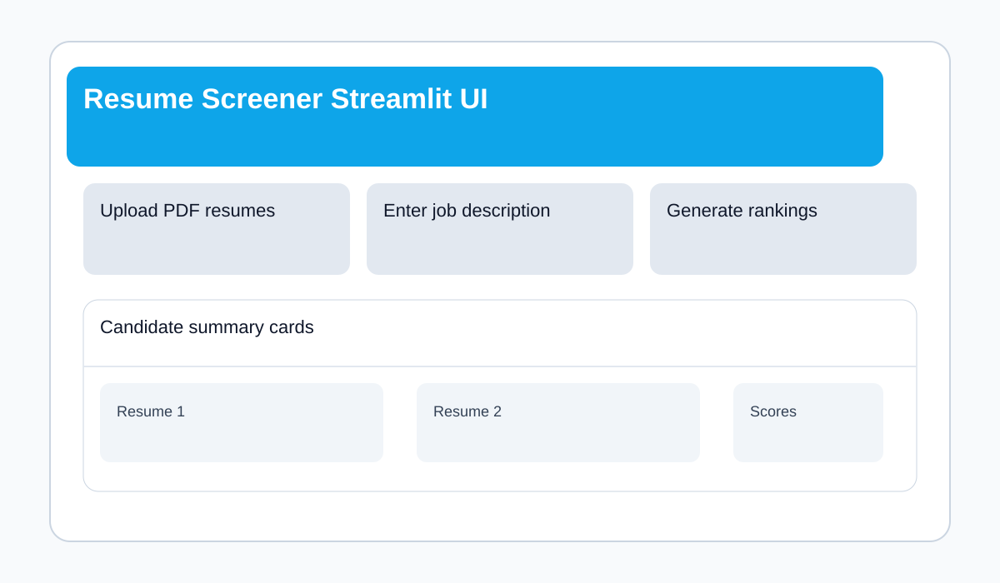
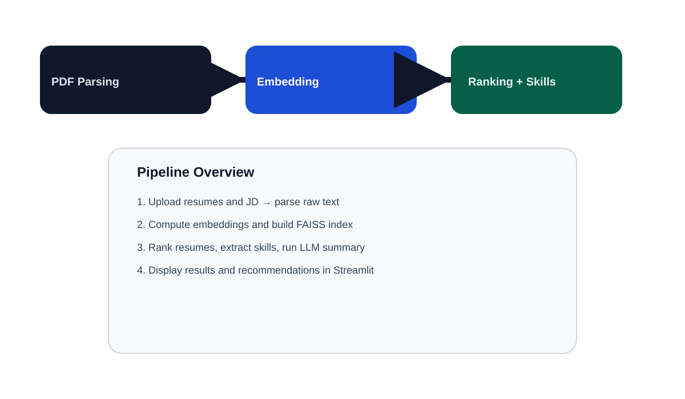

# 🧠 Resume Screener — AI-Powered Candidate Ranking

An end-to-end AI resume screening tool built with Python and Streamlit. Upload a job description and a batch of PDF resumes — the app parses, semantically ranks, extracts skills, and generates LLM-assisted candidate summaries using a multi-agent pipeline.

---

## ✨ Features

- 📄 **PDF Resume Parsing** — Extracts and cleans text from uploaded resume PDFs
- 🔍 **Semantic Ranking** — Cosine-similarity ranking against the job description using embeddings
- 🧩 **Skill Extraction** — Identifies matched and missing skills between JD and resumes
- 🤖 **LLM Agent Pipeline** — Generates candidate summaries and hiring recommendations
- 🗂️ **FAISS Vector Store** — Persistent FAISS index for fast similarity search
- ⚙️ **Dual Embedding Backends** — Supports Ollama (local) or HuggingFace (cloud)
- 🖥️ **Streamlit UI** — Clean, interactive interface for recruiters

---

## 📁 Project Structure

```
resume-screener/
├── app.py                  # Main Streamlit app & end-to-end workflow
├── config/
│   ├── settings.py         # Environment-driven app configuration
│   └── logging_config.py   # Logging setup
├── utils/
│   ├── parser.py           # PDF resume parsing and text cleaning
│   ├── embeddings.py       # Dual embedding backends + caching
│   ├── ranking.py          # Cosine-similarity resume ranking
│   └── skills.py           # Skill extraction and JD/resume analysis
├── agents/
│   └── recruiter_agent.py  # LLM pipeline for candidate summary/recommendation
├── vectorstore/
│   └── store.py            # FAISS index build / load / search / persistence
├── tests/
│   ├── unit/               # Unit tests (parser, skills, ranking, etc.)
│   └── integration/        # End-to-end pipeline integration tests
├── .github/
│   └── workflows/
│       └── ci.yml          # CI pipeline: lint, tests, type checking
├── requirements.txt
├── requirements-dev.txt
└── README.md
```

---

## 🚀 Getting Started

### Prerequisites

- Python 3.10+
- (Optional) [Ollama](https://ollama.ai) running locally for local embeddings

### 1. Clone the repository

```bash
git clone https://github.com/your-username/resume-screener.git
cd resume-screener
```

### 2. Create a virtual environment

```bash
python -m venv venv
source venv/bin/activate        # macOS/Linux
venv\Scripts\activate           # Windows
```

### 3. Install dependencies

```bash
pip install -r requirements.txt
```

Optionally, install development dependencies:

```bash
pip install -r requirements-dev.txt
```

### 4. Configure environment variables

Create a `.env` file manually or set the variables in your shell.

| Variable | Description | Default |
|---|---|---|
| `EMBEDDING_BACKEND` | `ollama` or `huggingface` | `huggingface` |
| `OLLAMA_EMBED_MODEL` | Ollama embedding model name | `nomic-embed-text` |
| `HF_EMBED_MODEL` | HuggingFace embedding model name | `sentence-transformers/all-MiniLM-L6-v2` |
| `LLM_BACKEND` | `groq`, `ollama`, or `openai` | `groq` |
| `GROQ_MODEL` | Groq LLM model name | `llama-3.3-70b-versatile` |
| `OLLAMA_LLM_MODEL` | Ollama LLM model name | `llama3` |
| `OPENAI_MODEL` | OpenAI LLM model name | `gpt-4o-mini` |
| `GROQ_API_KEY` | Groq API key | `""` |
| `OPENAI_API_KEY` | OpenAI API key | `""` |

### 5. Run the app

```bash
streamlit run app.py
```

Open [http://localhost:8501](http://localhost:8501) in your browser.

---

## 🧪 Running Tests

```bash
# All tests
pytest

# Unit tests only
pytest tests/unit/

# Integration tests
pytest tests/integration/
---

## 🖼️ Project Screenshots

### Streamlit UI



### Processing Pipeline


# With coverage
pytest --cov=. --cov-report=term-missing
```

---

## 🔄 CI/CD

GitHub Actions runs automatically on every push and pull request:

- ✅ Linting (`ruff`, `black`)
- ✅ Type checking (`mypy`)
- ✅ Unit & integration tests (`pytest`)

See [`.github/workflows/ci.yml`](.github/workflows/ci.yml) for configuration.

---

## 🏗️ Architecture

```
User (Streamlit UI)
        │
        ▼
   app.py (Orchestrator)
        │
   ┌────┴────────────────────┐
   │                         │
utils/parser.py        utils/embeddings.py
(PDF → clean text)     (text → vectors)
                             │
                       vectorstore/store.py
                       (FAISS index)
                             │
                       utils/ranking.py
                       (cosine similarity)
                             │
                       utils/skills.py
                       (skill gap analysis)
                             │
                   agents/recruiter_agent.py
                   (LLM summary + recommendation)
```

---

## 🤝 Contributing

1. Fork the repository
2. Create a feature branch: `git checkout -b feature/your-feature`
3. Commit your changes: `git commit -m 'feat: add your feature'`
4. Push to the branch: `git push origin feature/your-feature`
5. Open a Pull Request

---

## 📜 License

This repository does not include a `LICENSE` file. Add one if you want an explicit project license.

---

## 🙏 Acknowledgements

- [Streamlit](https://streamlit.io) — UI framework
- [FAISS](https://github.com/facebookresearch/faiss) — Vector similarity search
- [HuggingFace Transformers](https://huggingface.co) — Embedding models
- [Ollama](https://ollama.ai) — Local LLM inference